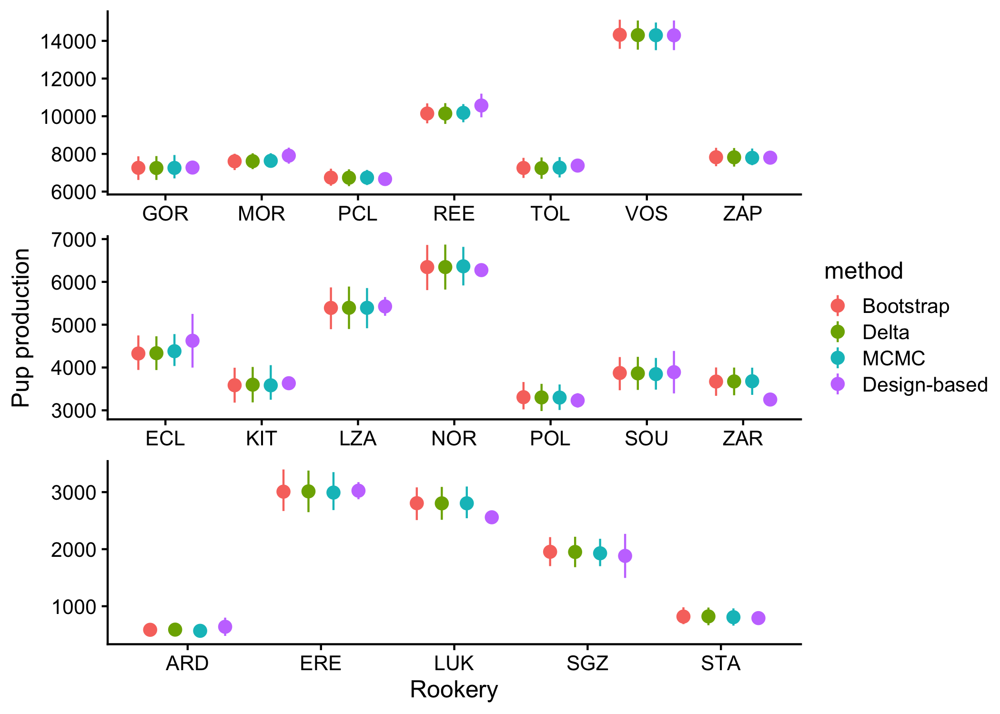

---
output:
  md_document:
    variant: gfm
---

<!-- README.md is generated from README.Rmd. Please edit that file -->

```{r, echo = FALSE}
knitr::opts_chunk$set(
  collapse = TRUE,
  comment = "#>",
  fig.path = "README-"
)
```

# Model-based pup production estimation (mbpp) for northern fur seals

This package implements 2 forms of model-based pup production estimation method: (1) A fully Bayesian MCMC via JAGS and (2) An asymptotically approximate model via TMB. 

## Installation

The package can be installed using the `devtools` package:
```{r, echo=FALSE, results='hide', message=FALSE}
library(devtools)
library(tidyverse)
library(rjags)
library(R2jags)
library(TMB)
library(furrr)
library(ggplot2)
library(cowplot)
library(coda)

```

```{r, message=FALSE, results='hide'}
### Download model fitting code and compile
devtools::install_github("dsjohnson/mbpp")
library(mbpp)
mbpp::compile_mbpp_tmb()

```
The last line is necessary to compile the `TMB` source code. This only needs to be done once.

## Example analysis

### Load data
```{r}
library(tidyverse)

data(nfs_mark)
data(nfs_resight)
# collect into islands for parallel fitting
nfs_mark <- nfs_mark %>% group_by(icode) %>% nest() %>% 
  rename(mark_data = data)
nfs_resight <- nfs_resight %>% group_by(icode) %>% nest() %>% 
  rename(resight_data = data)

nfs_data <- left_join(nfs_mark, nfs_resight)

head(nfs_data)
```

### Parallel processing 

```{r, eval=FALSE}
plan(multisession, workers=2)

## JAGS model fitting
set.seed(123)
nfs_data <- nfs_data %>% 
  mutate(
    mcmc_samp = future_map2(mark_data, resight_data,
                            ~jags_mbpp(mark_data=.x, resight_data = .y,
                                       n.iter=110000, n.burn=10000,
                                       n.chains=1
                            )
    )
  )

## Asymptotic model fitting
st <- Sys.time()
nfs_data <- nfs_data %>% 
  mutate(
    asym = future_map2(mark_data, resight_data,
                       ~asym_mbpp(
                         mark_data=.x, resight_data = .y,
                         control = list(eval.max=10000, iter.max=5000),
                       )
    )
  )
plan("default")
```

### Create parametric bootstrap sample
```{r, eval=FALSE}
nfs_data <- nfs_data %>% 
  mutate(
    asym_boot = map(asym, ~boot_asym(.x,size=1000))
  )
```

## Summarize $N$ estimation

```{r, eval=FALSE}
N_data <- nfs_data %>% select(icode, mcmc_samp) %>% 
  mutate(
    N_sum = map(nfs_data$mcmc_samp, 
                ~{
                  ci <- coda::HPDinterval(coda::mcmc(.x$fitting$mcmc_samples$N))
                  cbind(.x$N, ci) 
                }
    )
  ) %>% select(-mcmc_samp) %>% unnest() %>% mutate(method="MCMC")


N_data <- nfs_data %>% select(icode, asym) %>% 
  mutate(
    N_sum = map(asym, 
                ~{
                  cbind(.x$N, lower=.x$N$N-1.96*.x$N$se_N, upper=.x$N$N+1.96*.x$N$se_N) 
                }
    )
  ) %>% select(-asym) %>% unnest() %>% mutate(method="Asymp. approx.") %>% 
  bind_rows(N_data,.)

N_data <- nfs_data %>% select(icode, asym_boot) %>% 
  mutate(
    N_sum = map(asym_boot, 
                ~{
                  ci <- coda::HPDinterval(coda::mcmc(.x$N_boot))
                  cbind(.x$N, ci) 
                }
    )
  ) %>% select(-asym_boot) %>% unnest() %>% mutate(method="Bootstrap") %>% 
  bind_rows(N_data,.)
```

### Figure of reaults
```{r, echo=FALSE, message=FALSE}
analysis_dir <- "/Users/djohnson/research/projects/methodology_devel/model_based_pup_production/work/"
load(paste0(analysis_dir,"mbpp_results.Rdata"))
N_data <- N_data %>% mutate(
  size = ifelse(N>6500, "Large", "Medium"),
  size = ifelse(N<3100, "Small", size)
  )

N_data  <- N_data %>% 
  mutate(
    method = ifelse(method=="Asymp. approx.", "Delta", method)
  )

N_data <- bind_rows(
  {nfs_data$mark_data[[1]] %>% select(rcode, pupsborn, sep) %>% 
      mutate(method="Design-based") %>% rename(N = pupsborn, se_N=sep)},
  {nfs_data$mark_data[[2]] %>% select(rcode, pupsborn, sep) %>% 
      mutate(method="Design-based") %>% rename(N = pupsborn, se_N=sep)}
) %>% full_join(N_data %>% select(rcode, size, icode) %>% distinct()) %>% 
  mutate(upper = N+2*se_N, lower=N-2*se_N) %>% bind_rows(N_data)

N_data <- N_data %>% 
  mutate(
    method = factor(method, levels=c("Bootstrap", "Delta", "MCMC", "Design-based"))
  )
  

nplot <- ggplot(data=N_data) + 
  geom_pointrange(
    aes(x=rcode, y=N, ymax=upper, ymin=lower, color=method),
    position = position_dodge(width = 0.75)
  ) + facet_wrap(~size, ncol=1, scales="free") +
  xlab("Rookery") + ylab("Pup production") +
  theme_cowplot(12) + 
  theme(
    strip.background = element_blank(),
    strip.text = element_blank()
  )
cowplot::ggsave2("Nplot.png", nplot)


```

<!-- -->

# Disclaimer
*This software package is developed and maintained by scientists at the NOAA Fisheries Alaska Fisheries Science Center and should be considered a fundamental research communication. The reccomendations and conclusions presented here are those of the authors and this software should not be construed as official communication by NMFS, NOAA, or the U.S. Dept. of Commerce. In addition, reference to trade names does not imply endorsement by the National Marine Fisheries Service, NOAA. While the best efforts have been made to insure the highest quality, tools such as this are under constant development and are subject to change.*
